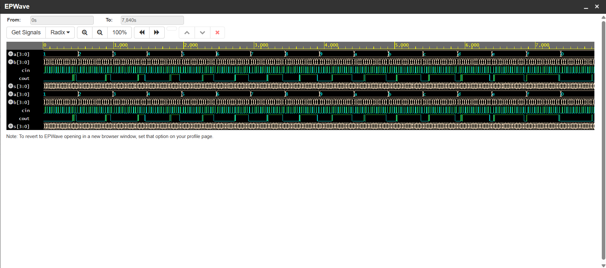

# RCA-4bit-Verilog
# 4-Bit Behavioral Full Adder

A hardware description project featuring a 4-bit Full Adder implemented using behavioral modeling in SystemVerilog. The project includes a comprehensive testbench that iterates through input combinations and generates waveform data for analysis.

## 📂 Project Structure

* `design.sv`: The RTL implementation of the 4-bit full adder using an `always@(*)` block.
* `testbench.sv`: SystemVerilog testbench that drives stimulus to the adder.
* `dump.vcd`: Value Change Dump file containing simulation waveforms.
* `run.sh`: Shell script used to compile and run the simulation using Icarus Verilog.

## 🛠️ Implementation Details

The adder is implemented behaviorally using the concatenation operator to handle the carry-out and sum simultaneously:
```systemverilog
{cout, s} = a + b + cin;



## How to Run
1. Upload `design.sv` and `testbench.sv` to [EDA Playground](https://edaplayground.com/).
2. Select **Icarus Verilog 12.0** as the simulator.
3. Ensure **Open EPWave after run** is checked in the left sidebar.
4. Click **Run** to execute the simulation and view the waveforms.

